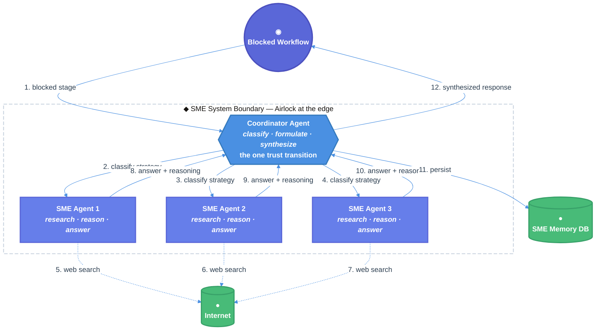

# SME Agent System Technical Design Document / RFC

| Document Metadata      | Details                                                                        |
| ---------------------- | ------------------------------------------------------------------------------ |
| Author(s)              | Cascadealot                                                                    |
| Status                 | Draft (WIP)                                                                    |
| Team / Owner           | Observatory                                                                    |
| Created / Last Updated | 2026-08-12                                                                     |

## 1. Executive Summary

This RFC proposes implementing an autonomous Subject Matter Expert (SME) agent system for Atomic workflows that replaces human-in-the-loop blocks. Currently, workflows stall in `awaiting_input` states when stages require human judgment, creating operational bottlenecks. The proposed solution introduces three core **doors** — `classify_block` (decides SME strategy), `orchestrate_sme` (coordinates expert panel), and `synthesize_response` (produces final answer) — as the single entrypoints for workflow unblocking. This system enables durable, inspectable runs with learning loops from stored reasoning, reducing workflow stall time from hours/days to seconds while maintaining decision quality through multi-agent consensus.

**Impact:** Eliminates workflow dependency on human availability, creates persistent knowledge base of expert reasoning, and composes with existing Atomic workflows (fan-out-and-synthesize, adversarial-verification, loop-until-done).

## 2. Context and Motivation

Cited research: `research/sme-agent-design.md`

### 2.1 Current State

**Architecture:** Atomic workflows use human-in-the-loop stages that block execution awaiting manual input.

**Limitations:**
- Workflows become `awaiting_input` and stall when a stage needs human judgment
- No persistent memory of decisions made — each workflow starts fresh
- Human availability becomes a critical path dependency
- No learning loop from past decisions

**Leaking doors (today):**
- Workflow stages directly call `await_human_input()` with unstructured context
- No single chokepoint for "workflow unblocking" — each stage handles it differently
- Decision reasoning is ephemeral, lost when workflow completes
- No distinction between simple vs. complex blocks requiring different SME strategies

### 2.2 The Problem

**User Impact:**
- Workflows stall indefinitely when humans are unavailable
- No audit trail of why decisions were made
- Same questions answered repeatedly without knowledge reuse

**Business Impact:**
- Operational overhead from manual workflow intervention
- Inconsistent decisions across workflow runs
- Lost opportunity for organizational learning

**Technical Debt:**
- Human-in-the-loop logic scattered across workflow definitions
- No persistent storage for decisions/reasoning
- No strategy for when to use single SME vs. cohort

## 3. Goals and Non-Goals

### 3.1 Functional Goals

- [ ] **Workflow unblocking:** Automatically substitute human blocks with SME agent responses
- [ ] **Persistent memory:** Store all SME interactions in SQLite for learning and reuse
- [ ] **Strategy selection:** Coordinator decides when to use single SME vs. 3-6 agent cohort
- [ ] **Internet research:** SMEs must use web search to access latest information
- [ ] **Structured output:** Each SME returns answer, reasoning, sources, and feedback notes
- [ ] **Synthesis:** Coordinator synthesizes final response from SME answers with reasoning
- [ ] **Integration:** Seamlessly integrate with existing Atomic workflow blocking mechanism
- [ ] **Durability:** All runs create inspectable artifacts and artifacts per SME

### 3.2 Non-Goals (Out of Scope)

- [ ] We will NOT replace all human-in-the-loop scenarios — only those where SME judgment is sufficient
- [ ] We will NOT implement vector search in Phase 1 (SQLite FTS5 only)
- [ ] We will NOT expose SME system as standalone API — only as workflow integration
- [ ] We will NOT auto-deploy to production — source-controlled package for manual deployment
- [ ] We will NOT support real-time streaming of SME reasoning — batch synthesis only
- [ ] We will NOT expose a second path to unblock workflows; `orchestrate_sme` remains the only chokepoint

## 4. Proposed Solution (High-Level Design)

### 4.1 System Architecture Diagram



### 4.2 Architectural Pattern

We are adopting a **Coordinator-Fanout-Synthesize** pattern:
1. **Classify:** Coordinator receives blocked workflow context and decides SME strategy
2. **Fan-out:** Parallel SME agents (1 for simple, 3-6 for complex) with dynamic expand
3. **Research:** Each SME uses web_search to access latest information
4. **Synthesize:** Fresh-context coordinator synthesizes final response
5. **Persist:** Write to SQLite via `ctx.tool` for durability

### 4.3 Key Components

| Component              | Responsibility                              | Technology Stack       | Justification                                      |
| ---------------------- | ------------------------------------------- | ---------------------- | -------------------------------------------------- |
| Coordinator Agent      | Classify blocks, formulate questions, synthesize answers | TypeScript, Atomic workflow | Central decision point for strategy selection      |
| SME Agents             | Research, reason, answer with sources       | TypeScript, web_search | Parallel expert panel with internet access         |
| SME Memory (SQLite)    | Persistent storage for Q&A, reasoning, feedback | SQLite with FTS5       | Durable, inspectable, supports full-text search    |
| SME Orchestrator Workflow | Workflow graph with classify → fanout → synthesize → persist | Atomic workflow DSL    | Tracked execution with artifacts and compaction protection |

### 4.4 The Door Set at a Glance (Stranger-Across-Time View)

`classify_block`, `formulate_sme_question`, `orchestrate_sme` ⚠, `synthesize_response`, `persist_sme_interaction`.

Reading these alone tells you: the system classifies workflow blocks, formulates precise questions, coordinates expert panels (the irreversible effect of unblocking), synthesizes final answers, and persists all interactions for learning. The irreversible effect (workflow unblocking) passes through `orchestrate_sme` as the single chokepoint.

## 5. Detailed Design

### 5.1 The Doors (Entrypoint Contracts)

```typescript
// — SME System Doors. The entrypoints that carry domain intent. —

// Research doc: research/sme-agent-design.md §Architecture in Atomic

classify_block(
  context: WorkflowBlockContext,  // blocked stage details, workflow run ID, stage ID
): Result<Classification, ClassificationError>
// Guarantee: analyzes a blocked workflow stage and returns SME strategy (single vs. cohort)
// Classification = SingleSME { role: SMERole } | CohortSME { roles: SMERole[], count: 3..6 }
// ClassificationError = InsufficientContext | AlreadyProcessed | UnsupportedBlockType

formulate_sme_question(
  classification: Classification,
  context: WorkflowBlockContext,
): Result<SMEQuestion, FormulationError>
// Guarantee: creates a precise, context-rich question for SME(s) with topic tagging
// SMEQuestion = { topic: string, subject: string, question: string, context_json: JSON }
// FormulationError = AmbiguousContext | MissingRequiredField

orchestrate_sme(
  question: SMEQuestion,
  strategy: Classification,
  idempotency_key: IdempotencyKey,  // prevents duplicate processing
): Result<SMECohortResult, OrchestrationError>
// Guarantee: IRREVERSIBLE — coordinates SME panel and returns synthesized answer
// This is the single chokepoint for workflow unblocking.
// SMECohortResult = { final_answer: string, reasoning: string, sources: string[], feedback_notes: string }
// OrchestrationError = SMEFailure | Timeout | DuplicateKey | SynthesisFailed

synthesize_response(
  sme_answers: SMEAnswer[],  // array of individual SME responses
  context: WorkflowBlockContext,
  iteration: number = 1,       // current deliberation round
  max_iterations: number = 3,  // maximum rounds before forcing consensus
): Result<SynthesizedResponse, SynthesisError>
// Guarantee: fresh-context synthesis with multi-round deliberation support
// If consensus not reached, returns RequestForRevision with SME IDs to re-ask
// SynthesizedResponse = { answer: string, reasoning: string, confidence: 0..1, dissent_notes: string[], iteration: number }
// SynthesisError = InsufficientConsensus | ConflictingAnswers | EmptyInput | MaxIterationsReached
// Multi-round: on InsufficientConsensus, coordinator instructs SMEs to revise based on peer answers

persist_sme_interaction(
  request: SMEQuestion,
  responses: SMEAnswer[],
  coordinator_decision: CoordinatorDecision,
): Result<PersistedRecord, PersistError>
// Guarantee: writes complete interaction to SQLite with topic tagging for learning loop

// — Type definitions that make illegal states unrepresentable —

type SMERole = "TechnicalArchitect" | "SecurityExpert" | "DomainSpecialist" | "UXDesigner" | "PerformanceEngineer"
// SME personas are dynamically defined by SMECa - no fixed enum
type SMEPersona = {
  role_title: string,        // e.g., "Hurricane window assessor, Florida post-disaster"
  expertise_domain: string,  // e.g., "insurance assessment software"
  context_constraints: string[], // e.g., ["southern florida", "post hurricane season"]
}


type WorkflowBlockContext = {
  workflow_run_id: string,
  stage_id: string,
  blocked_reason: string,
  stage_output: JSON,
  stage_input: JSON,
  artifacts: ArtifactRef[]
}

type SMEAnswer = {
  sme_id: string,
  sme_role: SMERole,
  sme_persona: SMEPersona,  // dynamic persona defined by SMECa
  answer: string,
  reasoning: string,
  feedback_notes: string,
  sources: string[],  // URLs from web_search
  created_at: string
}

type CoordinatorDecision = {
  request_id: string,
  decision: SingleSME | CohortSME,
  reasoning: string,
  final_answer: string
}
```

**Per-door audit (run the rubric):**

| Door                   | (1) Joint              | (2) One sentence, no "and"              | (3) Honest name                  | (5) Every exit                                   | (6) Refusals real                         | (7) Trust transition | (8) One chokepoint             |
| ---------------------- | ---------------------- | --------------------------------------- | -------------------------------- | ------------------------------------------------ | ----------------------------------------- | -------------------- | ------------------------------ |
| `classify_block`       | ✅ business verb       | ✅ "analyzes and returns SME strategy"  | ✅                                | insufficient context → `InsufficientContext`     | invalid role unrepresentable (type)       | n/a                  | classification, not irreversible |
| `formulate_sme_question` | ✅ business verb     | ✅ "creates precise question"           | ✅                                | missing field → `MissingRequiredField`           | malformed context rejected (type)         | n/a                  | question prep, not irreversible |
| `orchestrate_sme` ⚠    | ✅ business verb       | ✅ "coordinates SME panel"              | ✅ irreversible in doc + type     | SME failure → `SMEFailure`; timeout → `Timeout`  | duplicate key → `DuplicateKey`            | n/a                  | ✅ the sole workflow-unblocking door |
| `synthesize_response`  | ✅ business verb       | ✅ "synthesizes SME answers"            | ✅                                | conflicting → `ConflictingAnswers`               | empty input → `EmptyInput`                | n/a                  | synthesis, not irreversible |
| `persist_sme_interaction` | ✅ business verb    | ✅ "writes to SQLite"                   | ✅                                | DB error → `DBError`                             | schema mismatch → `SchemaMismatch`        | n/a                  | persistence, not irreversible |

### 5.2 API Interfaces — The Same Doors on the Wire

Since this is an internal Atomic workflow system, the "wire" is the workflow graph itself. However, for debugging and inspection, we expose these endpoints via workflow status/transcript:

```
# Workflow Integration — the trust transition at the edge
POST   /workflow/block-handler                  202 Accepted   # = classify_block + orchestrate_sme
#   Triggers when a workflow stage hits awaiting_input
#   Body: { workflow_run_id, stage_id, blocked_reason, context }
#   Returns: { synthesized_response, reasoning, sources }

# SME Memory — read-only inspection for learning
GET    /sme/memory/requests?topic={topic}       200 OK         # = search by topic (FTS5)
GET    /sme/memory/requests/{id}                200 OK         # = retrieve specific interaction
#   404 if request not found

# Orchestration Status — durable checkpoint
GET    /workflow/runs/{run_id}/sme-status       200 OK         # = orchestration progress
#   Returns: { phase: "classify"|"fanout"|"synthesize"|"persist", completed_smes: N, total_smes: M }
```

**Workflow Graph (Atomic DSL):**

```typescript
// workflows/sme-orchestrator.ts

export const smeOrchestrator = workflow({
  name: "sme-orchestrator",
  inputs: {
    workflow_run_id: z.string(),
    stage_id: z.string(),
    blocked_reason: z.string(),
    context: z.record(z.unknown())
  },
  stages: {
    classify: {
      action: "model",
      prompt: "Classify this workflow block: single SME or cohort? Cite research/sme-agent-design.md §Architecture",
      inputs: { context: ctx.inputs.context }
    },
    fanout: {
      action: "expand",
      from: { output: "classify", path: "/strategy/roles" },
      parallel: {
        agent: "sme-agent",
        task: "Research and answer: {item.question}. Use web_search. Cite sources.",
        model: "dynamic",  // each SME can use different model based on role
        progress: true
      }
    },
    synthesize: {
      action: "model",
      prompt: "Synthesize these SME answers into one final response. Note dissent. <keepContext>workflow_run_id</keepContext>",
      inputs: { answers: ctx.stages.fanout.outputs, context: ctx.inputs.context }
    },
    persist: {
      action: "tool",
      tool: "sme-persist",
      args: {
        request: ctx.stages.classify.outputs.question,
        responses: ctx.stages.fanout.outputs,
        decision: ctx.stages.synthesize.outputs
      },
      failureMode: "return"  // branch on failure, don't throw
    }
  }
})
```

### 5.3 Data Model / Schema

**SQLite Schema (research/sme-agent-design.md §Data Model):**

```sql
-- requests: workflow block questions with metadata
CREATE TABLE requests (
  id TEXT PRIMARY KEY,
  workflow_run_id TEXT NOT NULL,
  stage_id TEXT NOT NULL,
  topic TEXT NOT NULL,          -- FTS5 searchable
  subject TEXT NOT NULL,         -- FTS5 searchable
  question TEXT NOT NULL,
  context_json JSON NOT NULL,
  classification TEXT NOT NULL,  -- 'single' | 'cohort'
  created_at TEXT NOT NULL DEFAULT (datetime('now'))
);

-- sme_responses: individual expert answers
CREATE TABLE sme_responses (
  id TEXT PRIMARY KEY,
  request_id TEXT NOT NULL REFERENCES requests(id) ON DELETE CASCADE,
  sme_id TEXT NOT NULL,
  sme_role TEXT NOT NULL,        -- 'TechnicalArchitect' | 'SecurityExpert' | ...
  answer TEXT NOT NULL,
  reasoning TEXT NOT NULL,
  feedback_notes TEXT,
  sources JSON NOT NULL DEFAULT '[]',  -- array of URLs
  created_at TEXT NOT NULL DEFAULT (datetime('now'))
);

-- coordinator_decisions: final synthesized responses
CREATE TABLE coordinator_decisions (
  id TEXT PRIMARY KEY,
  request_id TEXT NOT NULL REFERENCES requests(id) ON DELETE CASCADE,
  decision TEXT NOT NULL,
  reasoning TEXT NOT NULL,
  final_answer TEXT NOT NULL,
  confidence REAL,               -- 0..1
  created_at TEXT NOT NULL DEFAULT (datetime('now'))
);

-- Full-text search index for topic/subject lookup
CREATE VIRTUAL TABLE requests_fts USING fts5(
  topic, subject, question,
  content='requests',
  content_rowid='rowid'
);

-- Trigger to keep FTS in sync
CREATE TRIGGER requests_ai AFTER INSERT ON requests BEGIN
  INSERT INTO requests_fts(rowid, topic, subject, question)
  VALUES (new.rowid, new.topic, new.subject, new.question);
END;
```

**Indexes for performance:**
```sql
CREATE INDEX idx_requests_topic ON requests(topic);
CREATE INDEX idx_requests_workflow ON requests(workflow_run_id);
CREATE INDEX idx_responses_request ON sme_responses(request_id);
CREATE INDEX idx_decisions_request ON coordinator_decisions(request_id);
```

### 5.4 Algorithms and State Management

**State Machine for Orchestration:**

```
BLOCKED → CLASSIFY → FANOUT (1..6 parallel) → SYNTHESIZE → PERSIST → COMPLETE
   ↓          ↓            ↓                      ↓           ↓
  error    error        timeout               conflict    db_error
```

Each transition is performed by a specific door:
- `BLOCKED → CLASSIFY`: triggered by workflow block handler
- `CLASSIFY → FANOUT`: `classify_block` returns strategy
- `FANOUT → SYNTHESIZE`: all SME answers collected
- `SYNTHESIZE → PERSIST`: `synthesize_response` returns final answer
- `PERSIST → COMPLETE`: `persist_sme_interaction` writes to SQLite

**Concurrency Model:**
- SME fanout uses dynamic expand (1 for simple, 3-6 for complex)
- Parallel tasks run with bounded concurrency (configurable, default 4)
- Idempotency keys prevent duplicate orchestration for same workflow block
- Optimistic locking on SQLite for concurrent writes

**Compaction Protection:**
- Critical context wrapped in `<keepContext>` tags for coordinator stages
- workflow_run_id, stage_id, and acceptance criteria tagged
- Bulk context passed via files/artifacts and `reads` rather than injected prompts

## 6. Alternatives Considered

| Option                                      | Pros                                        | Cons                                                   | Reason for Rejection                                                           |
| ------------------------------------------- | ------------------------------------------- | ------------------------------------------------------ | ------------------------------------------------------------------------------ |
| Option A: Single SME for all blocks         | Simpler implementation, lower cost          | Poor quality for complex decisions, no consensus       | Fails "strategy selection" goal; complex blocks need cohort                    |
| Option B: Always use 6-agent cohort         | Maximum quality, full consensus             | High cost, slow for simple blocks, overkill            | Wastes resources; violates "classify strategy" goal                            |
| Option C: Coordinator-only (no SME agents)  | Fastest, cheapest                           | No expert research, no internet access, no learning    | Fails core requirement: SMEs must research and reason                          |
| Option D: Human fallback after SME timeout  | Safety net for bad SME answers              | Reintroduces human dependency, defeats purpose         | Non-goal: we're replacing humans, not augmenting                               |
| Option E: Coordinator + dynamic SME (Selected) | Balanced quality/cost, strategy-aware     | More complex implementation                            | **Selected:** meets all goals, strategy selection, learning loop, durability   |

## 7. Cross-Cutting Concerns

### 7.1 Security and Privacy

**The trust transition is singular:** untrusted workflow context becomes trusted SME input only at `classify_block`. No other door accepts raw workflow data. (Rubric #7.)

**Authority carried by type:** destructive operations (DB writes) demand `ctx.tool` with explicit `failureMode: "return"`, so failures are handled gracefully without throwing. (Rubric #6.)

**Irreversible effects pass one chokepoint:** workflow unblocking via `orchestrate_sme` ⚠ is the single dominating door. All other doors (`classify_block`, `synthesize_response`, `persist_sme_interaction`) support but do not unblock. (Rubric #8.)

**Data Protection:**
- PII in workflow context (user emails, tokens) filtered before SME exposure
- SQLite database encrypted at rest (optional, deployment-specific)
- Sources logged but not stored if they contain sensitive URLs

**Threat Model:**
- Primary threat: compromised workflow context leaks to SME agents
- Remediation: input sanitization, context filtering, audit logging
- Secondary threat: SQLite database exposure
- Remediation: deployment-specific encryption, access controls

### 7.2 Performance Considerations

- **Latency target:** <30 seconds for simple blocks (single SME), <2 minutes for complex (cohort)
- **Cost target:** <$0.10 per orchestration (varies by model selection)
- **Concurrency:** bounded parallel SME runs (configurable, default 4)
- **Caching:** optional future enhancement — cache responses by question hash

### 7.3 Observability

- **Artifacts:** each SME run produces `answer.md`, `reasoning.md`, `sources.json`
- **Progress tracking:** `progress.md` in chain directory for each orchestration
- **Transcript:** workflow transcript captures all stages with `sessionFile/transcriptPath`
- **Metrics:** orchestration duration, SME count, synthesis confidence, persist success rate

## 8. Test Plan

### 8.1 Unit Tests

- **Door contracts:**
  - `classify_block`: test classification output for simple vs. complex blocks
  - `formulate_sme_question`: test question structure with topic tagging
  - `orchestrate_sme`: test idempotency key rejection for duplicate requests
  - `synthesize_response`: test conflict detection and consensus building
  - `persist_sme_interaction`: test SQLite write and FTS5 index update

- **Type refusals:**
  - Prove `orchestrate_sme` cannot accept unclassified context (type-level test)
  - Prove `synthesize_response` cannot accept empty SME answers
  - Prove `persist_sme_interaction` cannot write malformed JSON

### 8.2 End-to-End Tests

- **Simple block flow:** `blocked → classify (single) → fanout (1 SME) → synthesize → persist`
- **Complex block flow:** `blocked → classify (cohort) → fanout (3-6 SMEs) → synthesize → persist`
- **Idempotency test:** same workflow block with same key → one orchestration only
- **Persistence test:** query SQLite by topic → retrieve full interaction with sources

### 8.3 Integration Tests

- **Workflow integration:** trigger workflow block → SME system unblocks → workflow continues
- **Web search integration:** SME uses `web_search` → sources recorded → answer cites sources
- **Compaction test:** long orchestration → transcript compresses → tagged context survives
- **Failure recovery:** SQLite write fails → `failureMode: "return"` → branch handles error

### 8.4 Fuzz / Property Tests

- **Malformed input:** throw invalid workflow context at `classify_block` → reject gracefully
- **Concurrent orchestration:** same workflow block from multiple stages → idempotency converges
- **Source validation:** SME returns invalid URLs → filter before storage
- **Consensus property:** under any SME interleaving, `synthesize_response` converges on one answer

### 8.5 Interactive Verification

Run this checklist to confirm the feature is implemented correctly:

```bash
# 1. Verify door signatures exist
grep -r "classify_block\|orchestrate_sme\|synthesize_response\|persist_sme_interaction" workflows/

# 2. Verify SQLite schema
sqlite3 ~/.atomic/sme/sme.db ".schema"

# 3. Trigger a test workflow block
# (Manual: create a workflow that hits awaiting_input with SME context)

# 4. Verify orchestration completes
workflow status --filter "sme-orchestrator"

# 5. Verify persistence
sqlite3 ~/.atomic/sme/sme.db "SELECT topic, final_answer FROM coordinator_decisions LIMIT 5;"

# 6. Verify sources recorded
sqlite3 ~/.atomic/sme/sme.db "SELECT sources FROM sme_responses LIMIT 3;"

# 7. Verify compaction protection
workflow transcript --run-id <id> | grep "<keepContext>"
```

**Pass/fail conditions:**
- All doors exist with typed signatures
- SQLite schema matches spec
- Orchestration completes within 2 minutes
- Interactions persist with sources
- Tagged context survives compaction

## 9. Open Questions / Unresolved Issues

- [x] **SME role profiles:** No fixed roles - SMECa dynamically defines SME personas based on block context (e.g., "Hurricane window assessor, Florida post-disaster"). Coordinator creates full context and persona; we learn and iterate from usage data.
- [x] **Deployment target:** Deploy as Atomic package (@bastani/atomic-sme); cleanest integration with Atomic ecosystem and versioning.
- [x] **Model selection per SME:** Coordinator uses frontier-class LLM (Qwen3.5 122B); SMEs prefer deeper reasoning models (Qwen3.5 with thinking), with diversity (different models per SME) where practical. Coordinator accesses SME DB for context and documents decisions.
- [x] **Conflict resolution:** Multi-round deliberation — if coordinator has concerns, it instructs cohort to analyze each other's answers (all accessible via SME DB), revise with cross-referenced reasoning, and resubmit. Repeat until consensus or maximum iterations reached.
- [ ] **SME memory search:** Should `search_sme_db` support vector search in Phase 1, or is FTS5 sufficient? (Research doc mentions "optional vector index later" but doesn't specify Phase 1 scope.)
- [x] **Integration mechanism:** Default to intercom rescue (extension hook on workflow_stage_blocked); human-fallback wrapper as future configurable option that orchestrating agent can enable when needed.

---

**Backwards Compatibility:** Breaking changes allowed. This is a new system with no downstream dependencies. The door set (`classify_block`, `orchestrate_sme`, `synthesize_response`, `persist_sme_interaction`) is defined fresh with no legacy to preserve.
