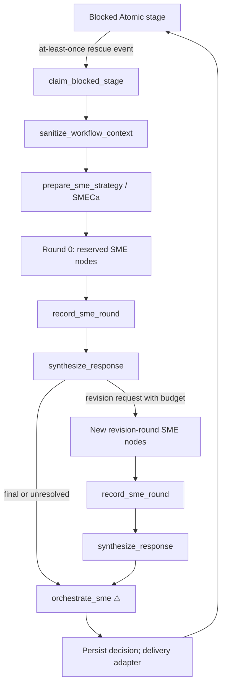

# Atomic SME Agent and Context Orchestration RFC

| Metadata | Value |
| --- | --- |
| Author | Cascadealot |
| Status | Draft — reviewed design |
| Owner | Observatory |
| Compatibility posture | Breaking changes allowed; this is a new package with no downstream contract to preserve. |

## 1. Executive Summary

Atomic workflows can stop when a stage needs judgment. This RFC defines the `@bastani/atomic-sme` package: an autonomous expert-panel service that receives a blocked stage, removes sensitive context, prepares a tailored SME panel, gathers researched answers, and returns one bounded unblock decision.

The central doors are `prepare_sme_strategy` and `orchestrate_sme` ⚠. The first names the kind of expertise and budget that a question needs. The second is the only door that can resume a blocked workflow. It either returns a supported answer, explicitly escalates, or reports that it cannot resolve the issue. It never silently resumes a workflow after an exhausted or failed deliberation.

The package also provides a context policy for SME stages and other opted-in Atomic workflows. It keeps identifiers and acceptance limits across compaction while moving bulk material through artifacts. SQLite with FTS5 records requests, every deliberation round, sources, budgets, and final decisions for later reuse and audit.

## 2. Context and Motivation

### 2.1 Current State

The founding design calls for a coordinator, one or more SMEs with web access, durable SQLite memory, and an Atomic workflow that classifies, fans out, synthesizes, then persists [research/sme-agent-design.md §Core Concepts; §Architecture in Atomic]. It identifies two possible integration paths: a wrapper around a workflow or an Intercom rescue hook [research/sme-agent-design.md §Integration with Blocked Workflows].

The current design leaves key contracts loose:

- a blocked stage can expose raw workflow context to an expert;
- the SME count, persona, model choice, and budget have no typed unit;
- answers are persisted only after synthesis, so peers cannot reliably inspect prior-round answers;
- the blocker callback is a generic handler rather than a named domain joint;
- retries can produce duplicate orchestration or resume effects.

### 2.2 Problem

A workflow should not wait for a person when qualified, evidence-backed automation can answer it. Yet automated judgment needs clear boundaries: safe context, explicit budgets, a durable audit trail, a clear consensus loop, and exactly one route that changes a blocked workflow into a continued one.

## 3. Goals and Non-Goals

### 3.1 Goals

- Replace eligible blocked workflow prompts through an Intercom rescue integration.
- Let SMECa, the coordinator and answer-preparing agent, dynamically define SME personas rather than select from a fixed role list.
- Give SMECa access to prior SME memory and require it to record its choice of personas, models, and budget.
- Prefer a frontier-class model for SMECa; let SMEs use available local reasoning models, using distinct models in a cohort when practical.
- Require SME web research and source capture for requests that need current external knowledge.
- Support peer-informed revisions through bounded, durable deliberation rounds.
- Store requests, each answer round, sources, strategy rationale, budget use, and final decision in SQLite with FTS5 search.
- Provide an opt-in context-management policy for this package and other Atomic workflows.
- Make duplicate block events converge on one recorded unblock decision.

### 3.2 Non-Goals

- The package does not guarantee that every blocked stage can be resolved without a person.
- The package does not add vector search in the first release; SQLite FTS5 is the memory search mechanism.
- The package does not make raw workflow transcripts broadly searchable.
- The package does not provide an alternate path that resumes a workflow; only `orchestrate_sme` may do that.
- The package does not deploy, publish, create a release, or open a pull request without a separately authorized final action.
- The optional workflow wrapper remains a later, opt-in integration; it is not the default rescue path.

## 4. Proposed Solution

### 4.1 System Diagram



**Airlock:** `sanitize_workflow_context` is the one conversion from raw blocked-stage data to SME-visible data. All later stages receive `TrustedWorkflowBlockContext` only.

**Delivery:** the Intercom extension emits an at-least-once, correlated rescue event. `claim_blocked_stage` writes the idempotency claim before any model call. Replayed events return the stored decision for the same payload hash; a reused key with a different payload is refused.

### 4.2 Pattern

The package uses a **claim → sanitize → prepare → deliberate → decide → record** pattern. It creates a bounded acyclic expansion per round: each revision request creates fresh, later SME, record, and synthesis nodes. The graph never reopens an earlier round. A coordinator may request another expansion only while durable budget remains.

### 4.3 Components

| Component | Responsibility |
| --- | --- |
| Intercom rescue extension | Detect an eligible blocked stage, produce a correlated at-least-once event, and deliver the final decision to the original workflow. |
| SMECa | Prepare personas, model preferences, strategy rationale, and a budget; synthesize outcomes. |
| SME cohort | Research a targeted question, provide cited reasoning, and revise only when requested. |
| SQLite memory | Store idempotency records, request briefs, answers per round, and audit data; serve bounded FTS5 queries. |
| Context policy | Filter sensitive fields, create artifacts for bulk context, and tag only critical constraints for compaction. |
| Atomic package config | Declare model selectors, limits, redaction rules, retention policy, and integration mode. |

### 4.4 Door Set at a Glance

`sanitize_workflow_context`, `prepare_sme_strategy`, `claim_blocked_stage`, `orchestrate_sme` ⚠, `reserve_sme_call`, `record_sme_round`, `synthesize_response`, `revise_sme_answer`, `persist_sme_interaction`, `search_sme_memory`, `inspect_sme_orchestration`, `purge_sme_memory` ⚠, `export_sme_audit_log`, `govern_workflow_context`.

The list says: accept a blocked request safely, prepare specialists, seek a decision, let them improve it, retain what happened, safely reuse knowledge, inspect the system, remove retained data only through one guarded door, and manage context discipline for workflows.

## 5. Detailed Design

### 5.1 Door Contracts

```ts
// The only raw-to-trusted transition.
sanitize_workflow_context(
  raw: RawWorkflowBlockContext,
  policy: ContextPolicy,
): Result<TrustedWorkflowBlockContext, SanitizationError>
// Guarantee: returns an SME-safe representation of the blocked stage.
// SanitizationError = ContextTooLarge | NoMeaningfulContent | SanitizationFailed

// SMECa has access to bounded SME memory before selecting a panel.
prepare_sme_strategy(
  context: TrustedWorkflowBlockContext,
  memory: RelevantSMEMemory,
  policy: SMEPolicy,
): Result<PreparedSMERequest, StrategyError>
// Guarantee: returns a documented, budgeted expert brief for the blocked stage.
// StrategyError = InsufficientContext | BudgetUnavailable | PersonaCreationFailed

// The one idempotency claim transition; no model call can start before this succeeds.
claim_blocked_stage(
  event: SMEBlockRescueRequested,
): Result<ClaimedBlockedStage, ClaimError>
// Guarantee: atomically claims one blocked stage for orchestration.
// ClaimError = DuplicatePayloadMismatch | ClaimUnavailable | InvalidRescueEvent

// ⚠ Only this door may cause the original workflow to continue.
orchestrate_sme(
  claim: ClaimedBlockedStage,
  prepared: PreparedSMERequest,
): Result<WorkflowUnblockDecision, OrchestrationError>
// Guarantee: settles one unblock decision for the claimed stage.
// OrchestrationError = BudgetExceeded | AllSMEsFailed | PersistenceUnavailable

record_sme_round(
  orchestration: OrchestrationId,
  round: DeliberationRound,
): Result<RecordedRound, PersistenceError>
// Guarantee: durably records a complete deliberation round before peer review.
// PersistenceError = DatabaseUnavailable | RoundAlreadyRecorded | SchemaMismatch

reserve_sme_call(
  claim: ClaimedBlockedStage,
  reservation: SMECallReservation,
): Result<ReservedSMECall, BudgetError>
// Guarantee: reserves durable budget for one SME call.
// BudgetError = CallsExhausted | CostLimitExceeded | BudgetStateInvalid

synthesize_response(
  round: RecordedRound,
  budget: RemainingDeliberationBudget,
): Result<SynthesisOutcome, SynthesisError>
// Guarantee: returns a final answer, a revision request, or an unresolved outcome.
// SynthesisError = EmptyRound | ContextMismatch | BudgetStateInvalid

revise_sme_answer(
  request: RevisionRequest,
  peer_answers: PeerAnswerSet,
): Result<SMEAnswer, RevisionError>
// Guarantee: returns one peer-informed revision for the named persona.
// RevisionError = PersonaNotInCohort | PeerSetInvalid | ResearchFailed

persist_sme_interaction(
  decision: WorkflowUnblockDecision,
  audit: OrchestrationAudit,
): Result<PersistedInteraction, PersistenceError>
// Guarantee: durably records the settled orchestration outcome.

search_sme_memory(
  query: SafeSearchQuery,
  scope: MemoryReadScope,
): Result<SMEMemoryPage, SearchError>
// Guarantee: returns only authorized, bounded SME memory matches.

inspect_sme_orchestration(
  id: OrchestrationId,
  scope: AuditReadScope,
): Result<OrchestrationStatus, InspectionError>
// Guarantee: returns the durable state of one orchestration.

// ⚠ Only this administrative door may irreversibly remove retained SME memory.
purge_sme_memory(
  authority: SMEDataRetentionAuthority,
  target: MemoryRetentionTarget,
): Result<PurgeReceipt, PurgeError>
// Guarantee: irreversibly removes the authorized retained SME records.

export_sme_audit_log(
  authority: SMEAuditExportAuthority,
  filter: RedactedAuditFilter,
): Result<RedactedAuditExport, ExportError>
// Guarantee: returns an authorized redacted SME audit export.
// ExportError = Unauthorized | FilterInvalid | ExportTooLarge

govern_workflow_context(
  request: ContextGovernanceRequest,
): Result<ContextGovernancePlan, ContextGovernanceError>
// Guarantee: returns a context-handling plan that preserves declared constraints.
```

#### Core Types and Refusals

```ts
type RawWorkflowBlockContext = {
  workflow_run_id: WorkflowRunId
  stage_id: StageId
  blocked_reason: string
  raw_input: JsonValue
  raw_output: JsonValue
  artifacts: ArtifactRef[]
}

type TrustedWorkflowBlockContext = {
  workflow_run_id: WorkflowRunId
  stage_id: StageId
  blocked_reason: string
  sanitized_input: JsonValue
  sanitized_output: JsonValue
  safe_artifacts: ArtifactRef[]
}

// Free-form by design; SMECa defines specialists from the task, not a fixed enum.
type SMEPersona = {
  id: PersonaId  // stable ID created by prepare_sme_strategy
  title: string
  domain: string
  local_conditions: string[]
  initial_brief: string
  preferred_model?: ModelSelector
}

type DeliberationBudget = {
  max_rounds: PositiveInt
  max_sme_calls: PositiveInt
  max_cost: MoneyLimit
}

type RemainingDeliberationBudget = {
  budget: DeliberationBudget
  spent_rounds: NonNegativeInt
  spent_sme_calls: NonNegativeInt
  reserved_cost: MoneyAmount
  spent_cost: MoneyAmount
  status: "active" | "exhausted"
}

type SMECallReservation = {
  persona_id: PersonaId
  round_number: PositiveInt
  estimated_cost: MoneyAmount
}

type ReservedSMECall = SMECallReservation & { reservation_id: ReservationId }

type PreparedSMERequest = {
  question: SMEQuestion
  personas: NonEmptyArray<SMEPersona>
  budget: DeliberationBudget
  rationale: string
}

// Created only by claim_blocked_stage after atomic idempotency insert.
type ClaimedBlockedStage = {
  orchestration_id: OrchestrationId
  workflow_run_id: WorkflowRunId
  stage_id: StageId
  idempotency_key: IdempotencyKey
  payload_hash: Hash
}

type SynthesisOutcome =
  | { kind: "final"; answer: SynthesizedResponse }
  | { kind: "revise"; request: RevisionRequest }
  | { kind: "unresolved"; reasons: NonEmptyArray<string> }

type WorkflowUnblockDecision =
  | { kind: "continue"; answer: SynthesizedResponse }
  | { kind: "escalate"; reasons: NonEmptyArray<string> }
  | { kind: "unresolved"; reasons: NonEmptyArray<string>; partial?: SynthesizedResponse }
```

`PreparedSMERequest` prevents callers from pairing an arbitrary question with unrelated personas or budget. `ClaimedBlockedStage` prevents a second delivery path from settling the same stage. `SynthesisOutcome` prevents a caller from treating a request for revision as a final answer. `TrustedWorkflowBlockContext` prevents an SME-stage API from accepting raw context.

#### Door Audit

| Door | One-sentence promise | Refusal / every exit | Chokepoint |
| --- | --- | --- | --- |
| `sanitize_workflow_context` | Returns SME-safe blocked-stage context. | Refuses oversized, empty, or unsanitizable content. | Sole raw-to-trusted context transition. |
| `prepare_sme_strategy` | Returns a documented, budgeted expert brief. | Refuses insufficient context or unavailable budget. | No. |
| `claim_blocked_stage` | Atomically claims one blocked stage. | Same payload replays settled state; changed payload refuses. | Sole idempotency claim path. |
| `orchestrate_sme` ⚠ | Settles one unblock decision for a claimed stage. | Cannot settle without a claim or a durable budget state. | Sole workflow-resume effect. |
| `reserve_sme_call` | Reserves durable budget for one SME call. | Refuses exhausted calls, cost, or invalid state. | Sole call-budget reservation path. |
| `record_sme_round` | Durably records one complete round. | Refuses duplicate round and database failure. | Sole peer-review record path. |
| `synthesize_response` | Returns final, revise, or unresolved. | Sum type forces all callers to handle all outcomes. | No. |
| `revise_sme_answer` | Returns one named persona’s peer-informed revision. | Refuses personas outside the cohort and invalid peer sets. | No. |
| `persist_sme_interaction` | Durably records one settled outcome. | Returns persistence failure without changing the settled decision. | Sole settled-outcome audit path. |
| `search_sme_memory` | Returns authorized bounded memory matches. | Refuses unsafe scope and query constraints. | Sole package memory-read path. |
| `inspect_sme_orchestration` | Returns durable orchestration state. | Refuses unauthorized audit scope and absent record. | Sole package status-read path. |
| `govern_workflow_context` | Returns an enforceable context-handling plan. | Refuses invalid classification or unapproved policy. | Sole package context-plan path. |
| `purge_sme_memory` ⚠ | Removes authorized retained records. | Requires retention authority and returns a receipt. | Sole destructive memory path. |
| `export_sme_audit_log` | Returns an authorized redacted audit export. | Refuses unsafe authority, filter, and output size. | Sole audit-export path. |

### 5.2 Rescue Event and Delivery Contract

The Intercom extension is an adapter, not a second domain door. It passes `SMEBlockRescueRequested` to `claim_blocked_stage`; only a successful claim may reach `orchestrate_sme`.

```ts
type SMEBlockRescueRequested = {
  event_id: EventId
  workflow_run_id: WorkflowRunId
  stage_id: StageId
  idempotency_key: IdempotencyKey
  raw_context: RawWorkflowBlockContext
}
```

- Delivery is **at least once**. `claim_blocked_stage` atomically inserts or reads `(workflow_run_id, stage_id, idempotency_key, payload_hash)` before any model call.
- A matching replay receives the recorded orchestration state or settled decision. A changed hash returns `DuplicatePayloadMismatch` and never resumes the workflow.
- A settled orchestration records delivery separately as `pending`, `delivered`, or `failed`.
- If delivery fails after settlement, the adapter retries delivery only and updates its delivery status. It does not rerun SMEs or change the settled decision.
- A terminal failed delivery stays inspectable and alertable; it is not an `OrchestrationError`.

### 5.3 Deliberation Lifecycle

1. The extension emits a rescue event; `claim_blocked_stage` atomically creates or returns its orchestration record.
2. `sanitize_workflow_context` creates trusted context under the configured redaction policy.
3. SMECa searches bounded prior memory and calls `prepare_sme_strategy`. It records why it chose each persona, model preference, and budget.
4. Before every SME invocation, `reserve_sme_call` durably reserves a call and estimated cost. The runtime records actual cost after the call.
5. Fresh SME nodes research and answer. `record_sme_round` persists those answers before synthesis.
6. `synthesize_response` returns `final`, `revise`, or `unresolved`.
7. For each `revise` outcome with active budget, the runtime creates a new, later revision round with fresh SME nodes, calls `record_sme_round`, then calls `synthesize_response` again.
8. `final` settles `continue`; `unresolved` settles `escalate` or `unresolved`. Budget exhaustion settles a non-continue decision.
9. `persist_sme_interaction` records the outcome and audit record. Implementation/review acceptance stops here. Publishing, deployment, release creation, and PR creation remain explicit final actions outside this lifecycle.

### 5.4 Context Management for SME and Other Workflows

The package exposes an opt-in `govern_workflow_context` policy for workflow authors.

- **Classify data:** mark fields as secret, PII, critical constraint, compact summary, or bulk artifact.
- **Airlock:** remove secret and PII values before external research or non-authorized model stages.
- **Keep context narrow:** wrap only objective, safety rules, acceptance criteria, identity fields, and budget constraints in `<keepContext>` tags.
- **Move bulk out:** write transcript excerpts, peers’ answers, source packs, and large code context to artifacts; stage prompts must say `Read the file at <path>...`.

**Enforcement:** the Atomic SME package runtime applies `ContextGovernancePlan` before it launches a covered stage. It creates approved artifacts, enforces their ACL metadata, rejects an unapproved raw-input stage binding, and limits protected prompt spans to the plan’s declared critical fields. Workflow authors opt in by wiring the returned plan into package-owned stage launch helpers; a plan that is not wired provides no protection.
- **Track lineage:** artifact metadata records source stage, redaction policy version, and allowed readers.
- **Apply elsewhere:** a workflow can call `govern_workflow_context` before a long-running reviewer, repair, or synthesis stage without adopting SME rescue.

```ts
export default defineSMEConfig({
  integration: { mode: "intercom-rescue", allowWorkflowWrapper: false },
  coordinator: { modelClass: "frontier", requireStrategyRationale: true },
  smes: { preferLocalReasoning: true, diversifyModelsWhenAvailable: true, requireWebResearch: true },
  memory: {
    engine: "sqlite-fts5",
    retention: "configured-policy",
    maxPageSize: 50,
    maxQueryLength: 500,
    retentionBatchSize: 100,
    checkpointPolicy: "configured-policy",
    ftsRebuildPolicy: "configured-policy"
  },
  context: { redactionPolicy: "strict", artifactFirst: true },
  budget: { maxRounds: 3, maxSMECalls: 18, maxCost: "configured-limit" }
})
```

### 5.5 SQLite Schema and Retention

```sql
CREATE TABLE orchestrations (
  id TEXT PRIMARY KEY,
  workflow_run_id TEXT NOT NULL,
  stage_id TEXT NOT NULL,
  idempotency_key TEXT NOT NULL,
  payload_hash TEXT NOT NULL,
  decision_json JSON,
  orchestration_status TEXT NOT NULL,
  delivery_status TEXT NOT NULL DEFAULT 'pending',
  spent_rounds INTEGER NOT NULL DEFAULT 0,
  spent_sme_calls INTEGER NOT NULL DEFAULT 0,
  reserved_cost TEXT NOT NULL DEFAULT '0',
  spent_cost TEXT NOT NULL DEFAULT '0',
  budget_status TEXT NOT NULL DEFAULT 'active',
  redaction_policy_version TEXT NOT NULL,
  created_at TEXT NOT NULL,
  settled_at TEXT,
  UNIQUE (workflow_run_id, stage_id, idempotency_key)
);

CREATE TABLE requests (
  id TEXT PRIMARY KEY,
  orchestration_id TEXT NOT NULL REFERENCES orchestrations(id) ON DELETE CASCADE,
  topic TEXT NOT NULL,
  subject TEXT NOT NULL,
  question TEXT NOT NULL,
  context_json JSON NOT NULL,
  personas_json JSON NOT NULL,
  budget_json JSON NOT NULL,
  strategy_rationale TEXT NOT NULL,
  memory_scope TEXT NOT NULL,
  artifact_acl_json JSON NOT NULL,
  created_at TEXT NOT NULL
);

CREATE TABLE sme_call_reservations (
  id TEXT PRIMARY KEY,
  orchestration_id TEXT NOT NULL REFERENCES orchestrations(id) ON DELETE CASCADE,
  persona_id TEXT NOT NULL,
  round_number INTEGER NOT NULL,
  estimated_cost TEXT NOT NULL,
  actual_cost TEXT,
  status TEXT NOT NULL,
  created_at TEXT NOT NULL,
  UNIQUE (orchestration_id, persona_id, round_number)
);

CREATE TABLE sme_responses (
  id TEXT PRIMARY KEY,
  request_id TEXT NOT NULL REFERENCES requests(id) ON DELETE CASCADE,
  persona_id TEXT NOT NULL,
  persona_json JSON NOT NULL,
  round_number INTEGER NOT NULL,
  answer TEXT NOT NULL,
  reasoning TEXT NOT NULL,
  sources_json JSON NOT NULL,
  feedback_notes TEXT,
  created_at TEXT NOT NULL,
  UNIQUE (request_id, round_number, persona_id)
);

CREATE TABLE purge_receipts (
  id TEXT PRIMARY KEY,
  authority_subject TEXT NOT NULL,
  target_hash TEXT NOT NULL,
  records_removed INTEGER NOT NULL,
  policy_version TEXT NOT NULL,
  created_at TEXT NOT NULL
);

CREATE TABLE audit_tombstones (
  id TEXT PRIMARY KEY,
  purge_receipt_id TEXT NOT NULL REFERENCES purge_receipts(id),
  orchestration_hash TEXT NOT NULL,
  created_at TEXT NOT NULL
);

CREATE VIRTUAL TABLE requests_fts USING fts5(
  topic, subject, question, strategy_rationale,
  content='requests', content_rowid='rowid'
);
CREATE TRIGGER requests_ai AFTER INSERT ON requests BEGIN
  INSERT INTO requests_fts(rowid, topic, subject, question, strategy_rationale)
  VALUES (new.rowid, new.topic, new.subject, new.question, new.strategy_rationale);
END;
CREATE TRIGGER requests_au AFTER UPDATE ON requests BEGIN
  INSERT INTO requests_fts(requests_fts, rowid, topic, subject, question, strategy_rationale)
  VALUES ('delete', old.rowid, old.topic, old.subject, old.question, old.strategy_rationale);
  INSERT INTO requests_fts(rowid, topic, subject, question, strategy_rationale)
  VALUES (new.rowid, new.topic, new.subject, new.question, new.strategy_rationale);
END;
CREATE TRIGGER requests_ad AFTER DELETE ON requests BEGIN
  INSERT INTO requests_fts(requests_fts, rowid, topic, subject, question, strategy_rationale)
  VALUES ('delete', old.rowid, old.topic, old.subject, old.question, old.strategy_rationale);
END;

CREATE INDEX idx_orchestration_stage ON orchestrations(workflow_run_id, stage_id);
CREATE INDEX idx_request_orchestration ON requests(orchestration_id);
CREATE INDEX idx_reservation_orchestration ON sme_call_reservations(orchestration_id);
CREATE INDEX idx_response_round ON sme_responses(request_id, round_number);
```

All reads must use the persisted `memory_scope`, a page limit, and query-length limits. Retention runs only through `purge_sme_memory`, writes a `purge_receipts` row, and leaves a non-sensitive `audit_tombstones` row. The package stores the redaction-policy version and artifact ACL for every request. Database maintenance uses the configured bounded deletion, checkpoint, and FTS rebuild policies.

## 6. Alternatives Considered

| Option | Result |
| --- | --- |
| One generic `block-handler` that researches and resumes | Rejected. It hides trust transition, strategy, and the resume effect in one god door. |
| A fixed five-role SME enum | Rejected. It blocks useful domain personas and conflicts with SMECa’s purpose. |
| Always use a full cohort | Rejected. It spends budget on simple questions. |
| One SME then automatic answer | Rejected. It cannot request peer review when reasoning is weak. |
| Unbounded peer debate | Rejected. It risks cost and liveness failure. |
| Default Intercom rescue with optional wrapper later | Selected. It removes human intervention where practical while leaving an explicit future fallback policy. |

## 7. Security, Privacy, Reliability, and Operations

- **Trust:** only `sanitize_workflow_context` converts raw data to an SME-visible value.
- **Authority:** `purge_sme_memory` requires a dedicated retention authority; standard workflow identity cannot create it.
- **Budget:** no SME call starts without remaining calls and cost allowance. A failed call consumes only the configured reservation policy and is recorded.
- **Model selection:** SMECa must use a configured frontier-class selector. SMEs prefer available local reasoning models and model diversity where it adds value. A missing preferred model falls back only under configured policy and is recorded.
- **External research:** web content is untrusted evidence. Answers cite sources; prompts must not treat fetched text as instructions.
- **Observability:** `inspect_sme_orchestration` exposes status, round count, budget state, model choices, delivery state, and consensus outcome. It must not expose redacted context to an unauthorized reader.
- **Health:** package metrics include rescue delivery failures, duplicate replays, budget exhaustion, unresolved outcomes, consensus rate, redaction failures, FTS query latency, and retention failures.

## 8. Test Plan

### 8.1 Door and Type Tests

- Raw context cannot be supplied where `TrustedWorkflowBlockContext` is required.
- `orchestrate_sme` rejects unclaimed stages at the type boundary.
- A `revise` outcome cannot reach the workflow-resume adapter.
- The unique orchestration key returns the original decision for an identical replay and refuses a changed payload.
- Only a retention authority can invoke `purge_sme_memory`.
- A duplicate claim must return recorded state before any model reservation or model call.
- A restart between reservation and model completion must retain the reservation and refuse budget overspend.
- `export_sme_audit_log` must redact fields outside the export authority’s scope.

### 8.2 Integration Tests

- Deliver a blocked-stage event twice; verify one SME execution plan and one persisted decision.
- Simulate delivery failure after a settled decision; verify the adapter retries delivery without new SME calls.
- Run a disagreement: verify first-round answers persist, revision nodes read peer artifacts, and a later round records separately.
- Exhaust the budget: verify the final result is `escalate` or `unresolved`, never `continue`.
- Insert, update, and delete memory records; verify FTS5 returns no stale result.
- Send PII and a secret in raw context; verify neither reaches an SME prompt, source artifact, audit result, or FTS index.

### 8.3 Context Policy Tests

- Confirm declared `<keepContext>` constraints survive compaction.
- Confirm large peer answers travel through artifacts rather than prompt injection.
- Confirm unauthorized stages cannot read a protected artifact.
- Apply `govern_workflow_context` to a non-SME reviewer workflow and verify its plan is enforced.

### 8.4 Interactive Verification

1. Trigger a controlled blocked stage with an idempotency key.
2. Inspect `inspect_sme_orchestration`; confirm sanitized, prepared, recorded, and settled states.
3. Query `search_sme_memory`; confirm strategy rationale, sources, and round lineage are present without raw secret values.
4. Replay the event; confirm the stored decision returns and no new SME run starts.
5. Trigger a deliberate disagreement under a small budget; confirm a revision or explicit unresolved decision.
6. Request an authorized purge; confirm records disappear, a receipt exists, and read APIs return the honest not-found result.

## 9. Open Questions / Unresolved Issues

Implementation must verify the available Atomic extension hook and its actual delivery semantics before this RFC can be marked Approved. It must also select real coordinator and SME model selectors from the configured Atomic model catalog. If either fact does not satisfy this RFC’s rescue or model requirements, revise the integration or configuration before implementation proceeds.

## Backwards Compatibility

Breaking changes are allowed. The package defines new workflow integration and context-policy surfaces. If a future workflow wrapper is introduced, it must be opt-in and must delegate to the same doors; it must not create a second resume path.
